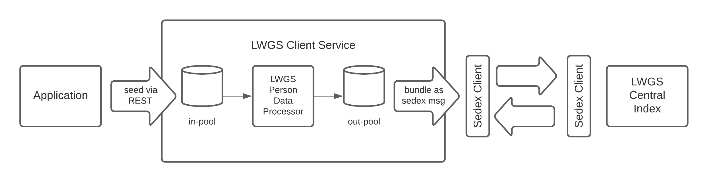
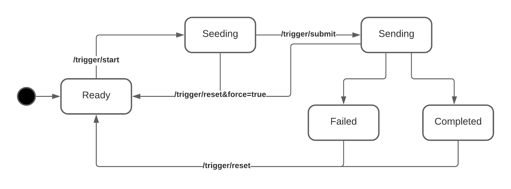
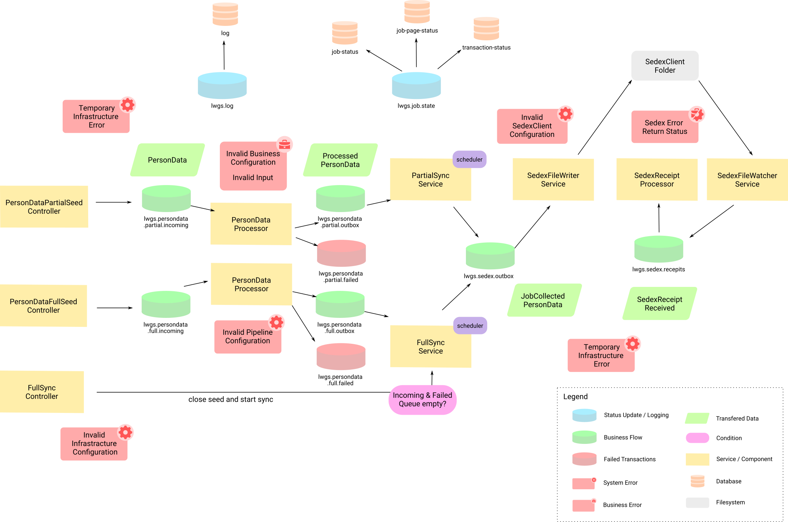

# LGS Person Data Processor Service

Reference implementation, wrapping the [lgs-person-data-processor](https://github.com/ch-bj/lgs-person-data-processor) 
library and implementing the "LGS Suchindex Client". Service allows to process and seed
personData to the central search index, part of Landesweite Grundstückssuche (LGS). Data is consumed via
a RESTfull interface, and passed on through Sedex after successful processing. The service allows either full or 
partial syncs.


## System Overview


### Interface to the Application

A documentation of the API interfaces can be found in the Swagger UI after the application is started:

http://localhost:8080/swagger-ui/index.html


### The LWGS Person Data Processor Service


### Connection to the Central LWGS Index


### Healthchecks

The basic healthchecks to verify that each service is properly bootstrapped and its dependencies are available, are implemented in the [docker-compose.yml](docker-compose.yml) of this repository.

For further information on how to monitor each service, please refer to the official documentation of each product.


## Using the LWGS Person Data Processor Service

### Introduction


For installation details have a look at the separate installation documentation:
- [Installation](doc/install.md) for the full dockerized environment
- [Development Installation](doc/development-install.md) for the development environment

If you have further questions please have a look at the [FAQ](doc/faq.md).

### Full Sync Flow
In case of a full sync the services allows the seeding party to explicitly enable, fill and submit a seeding job.
The following diagram shows the states of the seeding process in the full sync scenario.



#### Process
*  Set up a new full sync job with a call to the start
   ```sh
   curl --request PUT \
   --url http://<HOST>/api/v1/sync/full/trigger/start \
   --header 'Authorization: token <API_KEY>' \
   --header 'Content-Type: application/json'
   ```
   In return you'll get the following JSON confirming the new state and the ID of the newly created sync job.
   ```json
   {
      "jobId": "b2630b7d-d8ec-4ffc-9e16-fc9415a972e7",
      "seedStatus": "SEEDING"
   }
   ```
*  In the state `SEEDING` you'll now send all person data which should be transmitted to the central index.
   ```sh
   curl --request POST \
   --url http://<HOST>/api/v1/sync/full/person-data \
   --header 'Authorization: token <API_KEY>' \
   --header 'Content-Type: application/json'
   --data '{
   "metaData": {
   "personType": "NATUERLICHE_PERSON",
   "eventType": "INSERT"
   },
   "natuerlichePerson": {
   "egpId": "egpId",
   "name": "Smith",
   "vorname": "John",
   "jahrgang": "1970"
   }
   }'
   ```
   Each mutation will be confirmed with a transactionId.
   ```json
   {
      "transactionId": "d19b0584-5c4f-4686-8b37-f618e6a90ccb"
   }
   ```
*  After all data is sent to the job, it can be submitted for further processing.
   ```sh
   curl --request PUT \
   --url http://<HOST>/api/v1/sync/full/trigger/submit \
   --header 'Authorization: token <API_KEY>' \
   --header 'Content-Type: application/json'
   ```
   In return you'll get the following JSON confirming the new state and the ID of the newly created sync job.
   ```json
   {
      "jobId": "b2630b7d-d8ec-4ffc-9e16-fc9415a972e7",
      "seedStatus": "SENDING"
   }
   ```
* After setting the state to `SENDING` and processing all data, the aggregated, processed person data will then be 
  wrapped in a Sedex message and written to the filesystem with the next run of the `FullSyncService`.


### Partial Sync Flow

#### Process
*  For all mutations you want to propagate to the central index, you directly seed the person data which should be 
   transmitted.
   ```sh
   curl --request POST \
   --url http://<HOST>/api/v1/sync/partial/person-data \
   --header 'Authorization: token <API_KEY>' \
   --header 'Content-Type: application/json'
   --data '{
   "metaData": {
   "personType": "NATUERLICHE_PERSON",
   "eventType": "INSERT"
   },
   "natuerlichePerson": {
   "egpId": "egpId",
   "name": "Smith",
   "vorname": "John",
   "jahrgang": "1970"
   }
   }'
   ```
   Each mutation will be confirmed with a transactionId.
   ```json
   {
      "transactionId": "d19b0584-5c4f-4686-8b37-f618e6a90ccb"
   }
   ```
* The next time the configured implementation of the `PartialSyncService` will run, the processed seeds will be
  aggregated and written to a Sedex message.

## Detailed System Description

### Big Picture



### FullSyncService and PartialSyncService
The service allows two kinds of operation, a synchronisation with a full sync of all available data
with partial incremental syncs. In case of the full sync the integrating application will actively
trigger start and end of the seeding with a REST call. The full sync service will check in a fix
interval (see configuration options) for fully processed full-syncs and send content via Sedex.  
With the partial sync, the maintainer of the seeding proxy can configure several modes which define
when the pool of processed mutations should be bundled and send as Sedex message.

#### Partial Sync Scheduling Options
* `EVENT_DRIVEN`: Trigger sending of sedex once message was processed
* `FIXED_DELAY`: Trigger sending after a fix delay since the last run
* `CRON_SCHEDULE`: Trigger sending on a fix cron schedule (e.g. every night at 22:00)

#### Configuration Options Sync Flows
| Key | Default | Description |
|-----|---------|-------------|
| `lwgs.searchindex.client.sync.partial.scheduling-type` |`FIXED_DELAY` | Partial sync scheduling (allowed values: `EVENT_DRIVEN`, `FIXED_DELAY`, `CRON_SCHEDULE`)|
| `lwgs.searchindex.client.sync.partial.cron-schedule` |`0 0 * * * ?` (every hour)| Cron configuration, will be used if `scheduling-type` set to `CRON_SCHEDULE`|
| `lwgs.searchindex.client.sync.partial.fixed-delay` |`1'000` ms | Fixed delay interval in ms (with `scheduling-type` set to `FIXED_DELAY`)|
| `lwgs.searchindex.client.sync.full.fixed-delay` |`1'000` ms | Full sync interval|

##### Cron Syntax

```aidl
 ┌───────────── second (0-59)
 │ ┌───────────── minute (0 - 59)
 │ │ ┌───────────── hour (0 - 23)
 │ │ │ ┌───────────── day of the month (1 - 31)
 │ │ │ │ ┌───────────── month (1 - 12) (or JAN-DEC)
 │ │ │ │ │ ┌───────────── day of the week (0 - 7)
 │ │ │ │ │ │          (or MON-SUN -- 0 or 7 is Sunday)
 │ │ │ │ │ │
 * * * * * *
```

### SedexFileWriterService

The SedexFileWriter service will receive the JobCollectedPersonData objects from the
lwgs.sedex.outbox and create a zip file as Sedex payload. Each zip file will contain `[1..n]` zip
entries of GBPersonEvents.

#### Relevant configuration parameters

| Key | Default | Description |
|-----|---------|-------------|
| `lwgs.searchindex.client.sedex.base-path` |`/tmp/sedex` | Sedex base path|
| `lwgs.searchindex.client.sedex.receipt-path` |`receipts` | Sedex receipts path|
| `lwgs.searchindex.client.sedex.outbox-path` |`outbox` | Sedex outbox path|
| `lwgs.searchindex.client.sedex.create-directories` |`false` | Controls automatic creation of Sedex directories|
| `lwgs.searchindex.client.sedex.sender-id` | | Configures the senderId of the outgoing sedex message|
| `lwgs.searchindex.client.sedex.recipient-id` | | Configures the recipientId of the outgoing sedex message|
| `lwgs.searchindex.client.sedex.message.type` | | Configures the messageType of the outgoing sedex message|
| `lwgs.searchindex.client.sedex.message.class` | | Configures the messageClass of the outgoing sedex message|
| `lwgs.searchindex.client.sedex.file-writer.failure.throttling.base` |`1'000 ms` | Base for throttling interval in case of errors. Throttling interval doubles on each failed retry (until _max_ is reached).|
| `lwgs.searchindex.client.sedex.file-writer.failure.throttling.max` | `3'600'000 ms` (1h) | Controls max throttling interval in ms|
| `lwgs.searchindex.client.sedex.file-writer.fixed-delay` |`1'000 ms` | Execution interval of the SedexFileWriterService in ms|

#### Error Handling and resolution

If the sedex/outbox folder is not accessible or in case of any other IOException the SedexFileWriter
service will requeue the message and continue processing.

In cases of an exception the SedexFileWriter service will throttle processing until it successfully
processed a message.

Throttling can be configured by the following configuration keys:

`lwgs.searchindex.client.sedex.file-writer.failure.throttling.base` (default: 1000 ms)

`lwgs.searchindex.client.sedex.file-writer.failure.throttling.max` (default: 3600000 ms)

The throttling interval is calculated as following:

`waitingTime = min(2^retryCount * throttlingBase, throttlingMax)`

The issues need to be resolved manually by the administrator.

##### Proposed error resolution activities

- Check if Sedex outbox exists
- Check if Sedex outbox is accessible for search-index-client-service
- Check if enough disk space is available for volume containing Sedex outbox
- Check user quotas for volume

